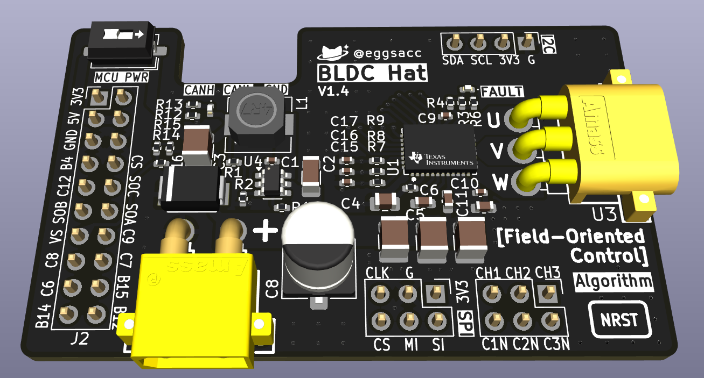
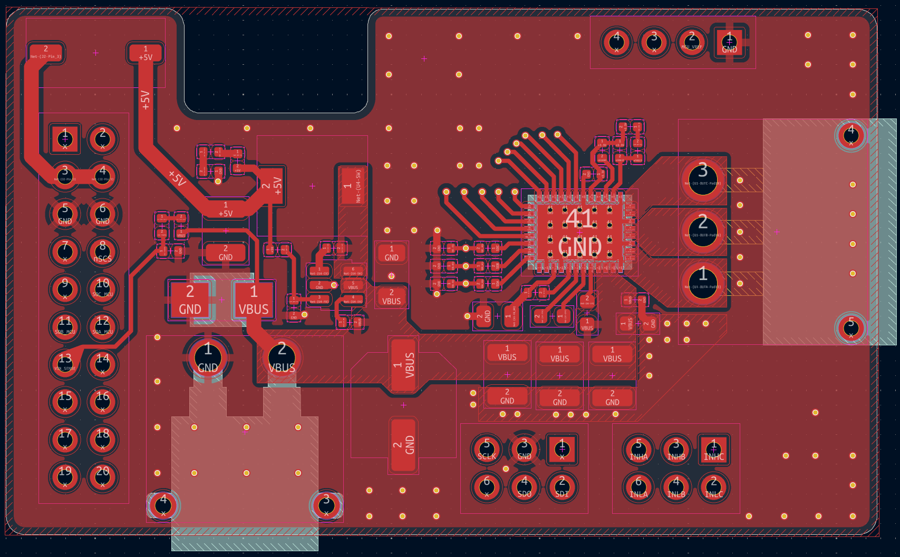
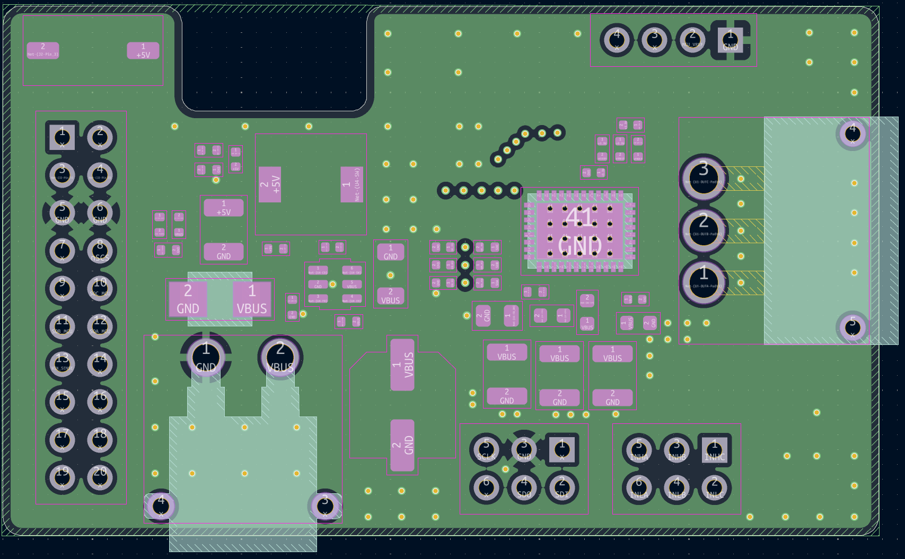
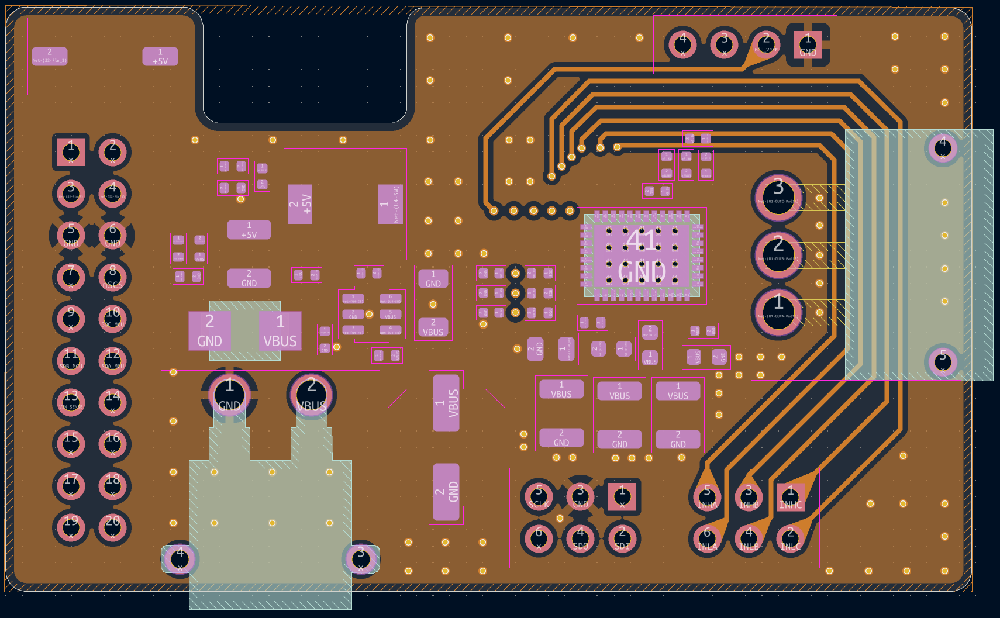
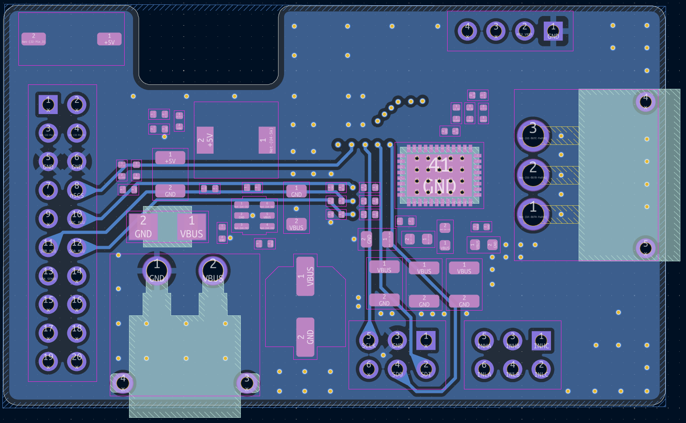
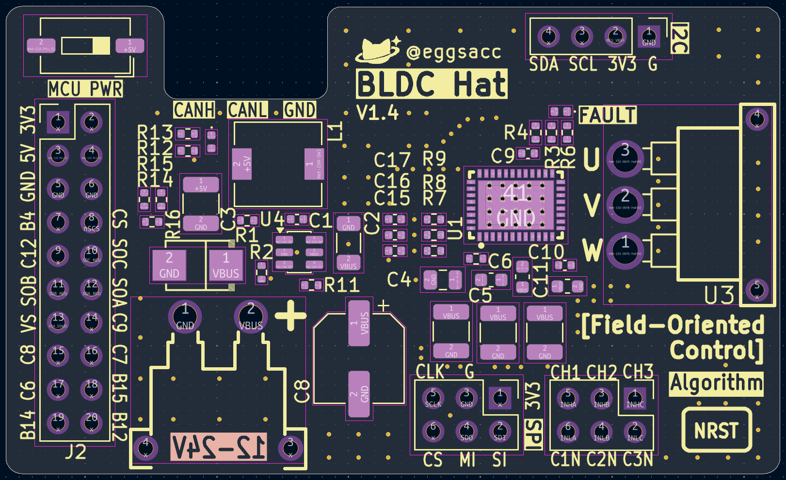
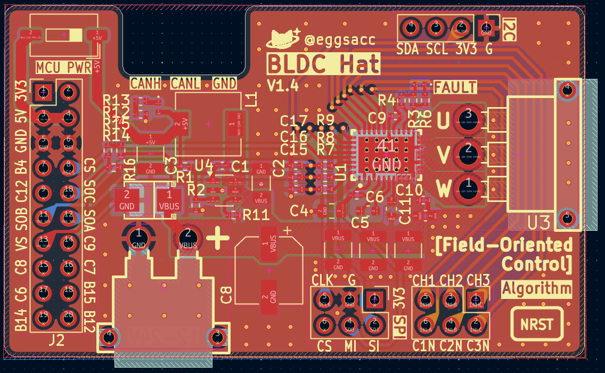

# BLDC Hat

A four-layer BLDC motor driver hat built around the TI DRV8316C for the [STM32F405 development module](https://github.com/eggsacc/stm32f405-module). It is intended for six-PWM motor control and field-oriented control experiments.

## Hardware

- Three-phase driver with six PWM inputs, three low-side current-sense outputs, SPI configuration/status, and motor-supply voltage sensing.
- Onboard 5 V buck converter with a switch for MCU power, plus power and fault LEDs.
- Four-layer PCB; board revision V1.4.

## Connectors

| Connector | Purpose |
| --- | --- |
| CN1 · XT30 | Motor power input (`VM_IN`) |
| U3 · MR30 | Three motor phases (`U`, `V`, `W`) |
| J2 · 2×10 | Interface to the STM32F405 module |
| J4 · 2×3 | Six PWM inputs (`CH1–3`, `C1N–3N`) |
| J1 · 2×3 | Driver SPI (`CLK`, `CS`, `MI`, `SI`, 3V3, GND) |
| J5 · 1×4 | I²C (`SDA`, `SCL`, 3V3, GND) |
| CN2 · XT30 | Optional motor-power output; marked DNP in the BOM |

With `MCU PWR` on, the hat supplies 5 V to the MCU module. Its [power guidance](https://github.com/eggsacc/stm32f405-module#power) warns against connecting USB and external 5 V at the same time.

## Layout
>L1: Power & signal

>L2: GND

>L3: GND + PWM signal

>L4: GND + signal

> Silkscreen

>Combined

The [KiCad project](HatDrive_kicad/) contains the schematic, PCB, and manufacturing files. See the [MCU module README](https://github.com/eggsacc/stm32f405-module) for its pinout.

---

Designed by <b>@eggsacc</b> · HatDrive V1.4  
Updated 02/10/2026

